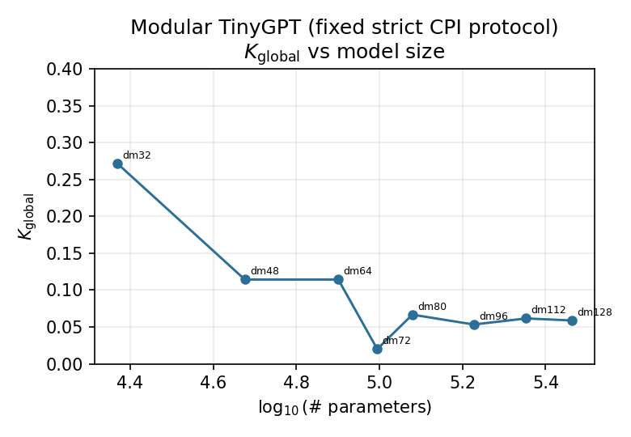
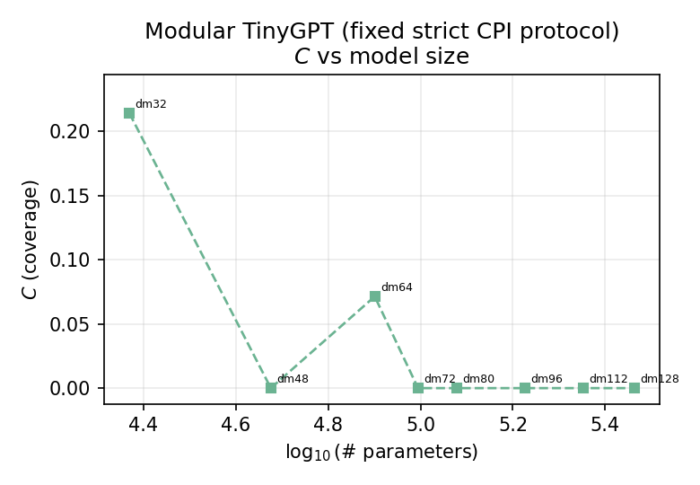
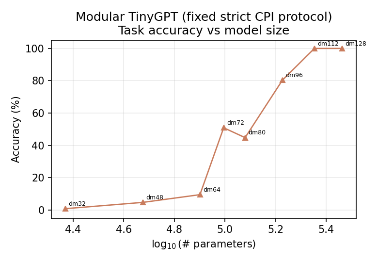
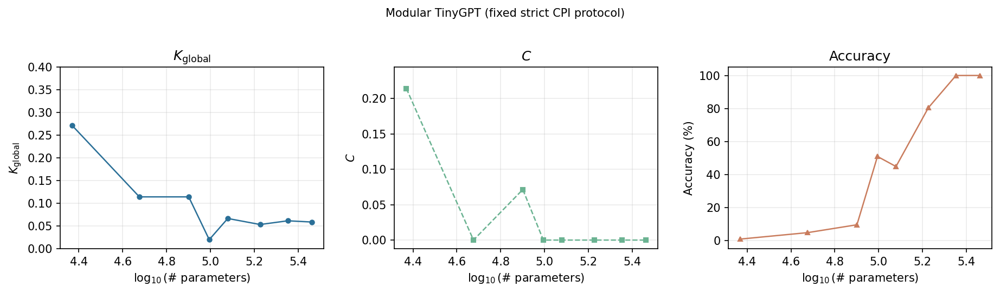

# Confident Partial Interpretability (CPI)

**Confident Partial Interpretability (CPI)** is a research program investigating whether partial but high-confidence mechanistic interpretability can be used as a practical safety control for neural networks.

The core thesis is that we may not need complete interpretability to make meaningful progress on alignment. Instead, it may be enough to identify and operate within the subset of model states that are interpretable with sufficient confidence, while restricting or blocking transitions into states that are not.

This repository currently contains:
- **`pre-registration_paper.md`** — full CPI framework, measurement methodology, limits of the claims, and a **testable** interpretability scaling-law conjecture (no empirical results reported).
- **`hypothesis.md`** — compact pre-experiment predictions, pipeline sketch, and success/failure criteria (**no scaling law assumed a priori** for those gates; no results claimed).

The repo includes **metric code** (`metrics/`), **configs**, **`experiments/synthetic_demo.py`**, and **PyTorch experiments** (install `pip install -e ".[experiments]"`): **modular addition** (Nanda et al., 2023), **induction** (Olsson et al., 2022), **`measure_cpi_toy.py`**, and **`hf_cpi_probe.py`** for Hugging Face LMs (Ollama does not expose residuals for CPI-style hooks — see **`docs/EXPERIMENTS.md`**). A GitHub Actions workflow template lives in **`docs/github-actions-ci.yml`**.

## Thesis

CPI explores the idea that alignment can be reframed as a control problem:

- identify internal states the model can be interpreted in,
- validate those interpretations through causal intervention,
- and constrain deployment or training to the safe, interpretable region.

Rather than asking whether interpretability solves alignment in the abstract, CPI asks a narrower and more empirical question:

> Can a model be made safe enough for deployment by operating only inside regions where its internal state is interpretable and causally legible?

CPI does **not** assume that interpretability alone is globally sufficient for alignment. Sufficiently confident interpretability over a **bounded** domain is claimed to make alignment **operationally tractable within that domain** only; see `pre-registration_paper.md` Section 4 for caveats (aliasing, composition, deception inside the monitored region, and more).

## Why this matters

A major challenge in alignment is that we do not know how to reliably read a model’s internal state from its weights and activations. CPI treats that as an engineering problem rather than a philosophical one.

If we can measure when an interpretation is reliable and how much of a model is covered by reliable interpretations, then interpretability becomes something we can:
- test,
- quantify,
- compare across models,
- and eventually use as a runtime safety mechanism.

## Core concepts

CPI is built around two measurements (definitions and protocol details are in `pre-registration_paper.md`):

### Coverage (C)

The fraction of **causally relevant** internal states for which a **reliable** interpretation exists (under the chosen task and sampling scheme).

### Confidence (K)

The probability that an interpretation **correctly predicts** model behavior under **causal intervention** (e.g. ablation, patching, steering), relative to a specified divergence tolerance.

A high-confidence interpretation should predict distributional shifts in outputs when relevant internal components are intervened on—not merely correlate with behavior.

## Working hypothesis

The project starts from the hypotheses summarized in `hypothesis.md`:

1. Some model states are more interpretable than others.
2. Interpretability can be operationalized and measured via **C** and **K** under an explicit intervention protocol.
3. Restricting the model to high-confidence regions (CPI-style domain restriction) can **measurably constrain behavior**; **capability retention is not assumed** (see `hypothesis.md`, Prediction 3).
4. The **pre-registration paper** additionally advances an **interpretability scaling-law conjecture** (how **C** and **K** may vary with effective complexity). That is a **hypothesis to test**, not a premise of the short pre-experiment document.

If these claims hold even partially, CPI may provide a practical pathway toward safer deployment of capable systems.

## Research questions

- How much of a model’s **causally relevant** behavior can be covered by interpretations that pass a **K** threshold?
- Does measured **K** actually predict intervention outcomes on held-out states or interventions?
- How stable are **C** and **K** across prompts, seeds, and checkpoints?
- Under domain restriction, do outputs change in ways **consistent with** the interpretability mapping **f**?
- (From the pre-registration paper) If scaling experiments are run: do **C** and **K** follow a predictable relationship with effective dimensionality?

## Experimental program

The initial plan (see `hypothesis.md`) is:

- small transformers (on the order of 1–2 layers to start),
- a simple, mechanistically analyzable task,
- sampling **(layer ℓ, token position t, input x)** from the task distribution **D**,
- relevance via intervention, then **K** from prediction vs observed intervention effects, then **C** as the fraction of relevant states with **K ≥ τ**.

If these experiments produce strong signals, the same framework can be extended to richer settings.

## Empirical illustration: modular TinyGPT scaling

This section is **exploratory toy data** for the repo’s CPI tooling. It is **not** a substitute for claims in `pre-registration_paper.md` (which remains methodology-first). It shows how **K**, **C**, and **task accuracy** co-vary across model width when the **intervention protocol is held fixed** (`experiments/modular_scaling_sweep.py`: residual ablations, relevance ε, bucketed sampling as in `measure_cpi_toy.py`).

**What “accuracy” means here.** Models are trained on **Nanda-style modular addition**: sample integers \(a, b \in \{0,\ldots,p-1\}\) with default **\(p = 97\)**, feed tokens \([a, b, '=']\), and train the network to predict **\(c = (a + b) \bmod p\)** as a **single next-token classification** over digit logits at the prediction position (see `experiments/tasks_toy.py`, `ModularConfig`). Reported **accuracy** is the fraction of **fresh samples** from that same generator for which the **argmax logit** at that position equals \(c\) (default eval: 32 batches × 256 examples after loading each checkpoint).

**Quick quantitative summary (8 checkpoints, seed 0, 4000 train steps; fixed τ=0.6, atol=0.01).** Across the width sweep, **\(K_{\mathrm{global}}\)** ranges from about **0.02 to 0.27**, while **\(C\)** ranges from **0 to 0.21** (and is often exactly 0 under this coarse bucket + thresholding). Task accuracy ranges from **~0.009 to 1.0**. In this run, Pearson correlations are approximately **−0.81** (log10 parameters vs \(K_{\mathrm{global}}\)), **−0.75** (log10 parameters vs \(C\)), and **+0.93** (log10 parameters vs accuracy); accuracy also correlates negatively with \(K_{\mathrm{global}}\) (~**−0.66**) and with \(C\) (~**−0.59**). These correlations are **protocol-dependent** and not a proof that “scale alone” causes the trend.

**Why \(C\) can sit near zero while \(K_{\mathrm{global}}\) is nonzero.** Under `measure_cpi_toy.py`, **\(C\)** is the fraction of **coarse buckets** (each bucket aggregates several residual dimensions) whose **per-bucket** \(K\) clears a threshold **τ**. **\(K_{\mathrm{global}}\)** pools many single-dimension probes into one score. So low **\(C\)** is consistent with “almost no bucket looks uniformly well predicted under the strict atol,” even when some probes still match (nonzero global \(K\)). Better local linearization, attribution, or intervention alignment should raise **per-bucket** \(K\), which raises **\(C\)** for fixed **τ**—that is the intended improvement path for future methods.

**Figures** (same run, fixed protocol; regenerate via `modular_scaling_sweep.py`):









*Regenerate (and add more widths) with:*

```bash
pip install -e ".[experiments,plots]"
python experiments/modular_scaling_sweep.py --steps 4000 --seed 0
# Redraw from existing summary JSON only:
python experiments/modular_scaling_sweep.py --plot-only
```

The default width grid is **29** checkpoints (`d_model = 16, 20, \ldots, 128` in steps of 4). Use `--d-models …` for a faster subset. Summary JSON: `outputs/modular_scaling/modular_scaling_summary.json`.

## Code quickstart

```bash
python -m venv .venv
source .venv/bin/activate   # Windows: .venv\Scripts\activate
pip install -e ".[dev,experiments]"
pytest -q
python experiments/synthetic_demo.py
# Nanda-style modular addition → checkpoint → CPI metrics (K, C)
python experiments/train_toy.py --task modular --steps 8000 --out outputs/checkpoints/modular.pt
python experiments/measure_cpi_toy.py --ckpt outputs/checkpoints/modular.pt
# Induction (Olsson-style minimal task)
python experiments/train_toy.py --task induction --steps 12000 --out outputs/checkpoints/induction.pt
# Larger introspectable LM (HF): relevance ε, bucketed C, logged protocol
python experiments/hf_cpi_probe.py --model gpt2 --prompts-file docs/sample_prompts.txt --n-buckets 15 --dims-per-bucket 5 --relevance-epsilon 0.02 --atol 0.5 --tau 0.6
```

- **`docs/EXPERIMENTS.md`** — citations, Ollama vs HF, scaling ladder.
- **`experiments/plot_cpi_summary.py`** — one-graph, four-stat summary from a CPI JSON artifact.
- **`synthetic_demo.py`** — non-model metric sanity check only.
- **`configs/default.yaml`** — synthetic demo knobs; training uses CLI args in `train_toy.py`.
- **`docs/github-actions-ci.yml`** — CI template (needs PAT `workflow` scope to push under `.github/`).

## Repository layout

```text
.
├── README.md
├── hypothesis.md
├── pre-registration_paper.md
├── pyproject.toml
├── configs/
│   └── default.yaml
├── metrics/
│   ├── confidence.py    # K (§6)
│   └── coverage.py      # C (§7)
├── docs/
│   ├── figures/         # e.g. modular_scaling_triptych.png (for README)
│   ├── EXPERIMENTS.md
│   └── github-actions-ci.yml
├── experiments/
│   ├── synthetic_demo.py
│   ├── tiny_gpt.py
│   ├── tasks_toy.py
│   ├── train_toy.py
│   ├── measure_cpi_toy.py
│   ├── hf_cpi_probe.py
│   ├── modular_scaling_sweep.py
│   ├── plot_cpi_summary.py
│   ├── plot_cpi_json.py
│   ├── train_toy_model.py   # legacy stub
│   └── interventions.py
├── tests/
│   └── test_metrics.py
└── outputs/             # json + checkpoints (gitignored)
```

## File roles

- **`README.md`** — project overview aligned with the pre-registration and hypothesis documents.
- **`hypothesis.md`** — pre-experiment predictions, validation criteria (**success if any** / **failure if all**), and explicit note that **no results are claimed** there.
- **`pre-registration_paper.md`** — full CPI pre-registration: metrics, methodology, enforcement sketch, scaling-law hypothesis, and references.
- **`metrics/`** — reference implementations of **K** and **C** matching the paper’s definitions (extend for your divergence metric of choice).
- **`experiments/synthetic_demo.py`** — non-model metric sanity check.
- **`experiments/train_toy.py` / `measure_cpi_toy.py`** — TinyGPT + modular (Nanda) / induction (Olsson); **K** and **C** from gradient Δ vs ablation.
- **`experiments/hf_cpi_probe.py`** — same **K** idea on HF GPT-2–style stacks.
- **`docs/EXPERIMENTS.md`** — full citation list and Ollama vs HF note.

## What counts as success

Aligned with `hypothesis.md`, the experimental program is judged **successful if any** of the following hold:

- **K** predicts intervention outcomes on sampled states.
- **C** or **K** improves with better interpretability methods (or the tractable domain expands).
- Domain restriction **constrains behavior** in ways consistent with **f**.
- **C** / **K** provide useful guidance for research direction (operationalize as you tighten the program).

**Failure** is only registered if **all** of the corresponding negative conditions in `hypothesis.md` hold—see that file for the exact list.

Even a negative result is valuable if it shows that confident interpretability is too unstable, too sparse, or too expensive to support deployment-style control.

## Why this repo is different

This project is not just another interpretability demo.

It is an attempt to turn interpretability into a **safety-relevant control framework** by separating:
- what we can understand,
- how reliably we understand it (**K**),
- and how much of the relevant state space that covers (**C**).

That distinction matters because it turns a vague safety aspiration into a testable empirical program—with explicit limits on what is guaranteed (again, see Section 4 of the pre-registration paper).

## Status

**Empirical runs are tooling-first:** train a checkpoint with `train_toy.py`, then `measure_cpi_toy.py` writes JSON under `outputs/` (gitignored). Treat numbers as **protocol-dependent** until you freeze atol/τ/sampling and train to convergence (modular addition often needs thousands of steps; see Nanda et al., 2023). **Ollama** is not used for CPI hooks — use **HF** models or TransformerLens/nnsight for tensor access (`docs/EXPERIMENTS.md`).

## Research style

This repo is designed to support a serious research workflow:
- theory and pre-registration first,
- explicit hypotheses and falsification-style criteria (`hypothesis.md`),
- controlled experiments,
- explicit metrics,
- and evidence-driven iteration.

## References

Background citations and a short bibliography are in **`pre-registration_paper.md`** (References section).

## License

To be added.

## Contact

Manu Prabakaran, Rice University
